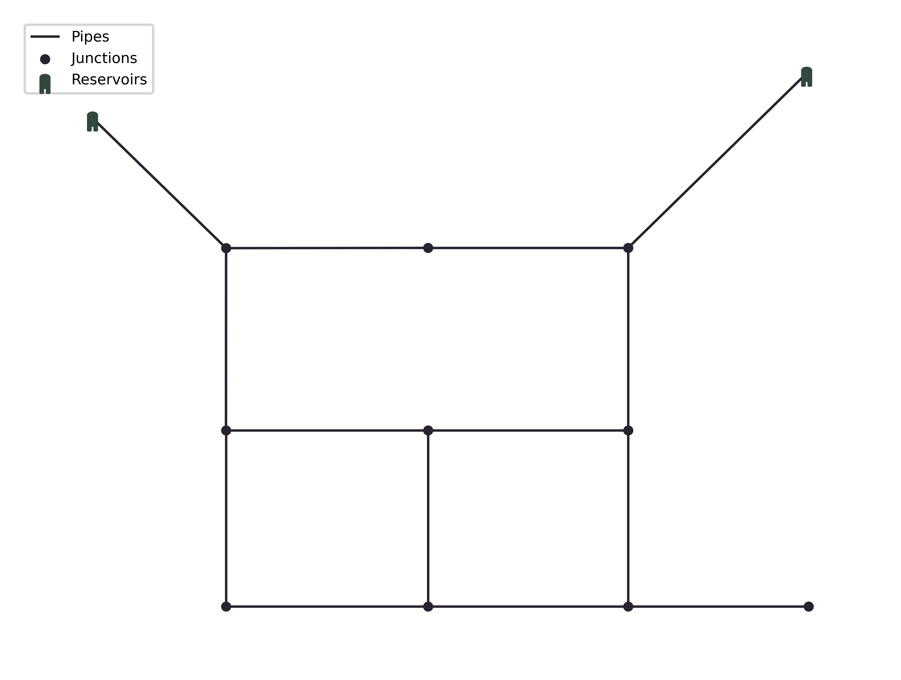
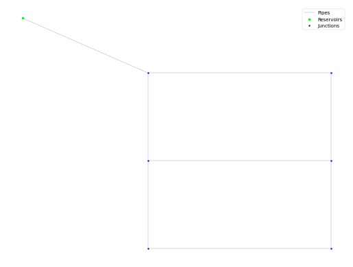
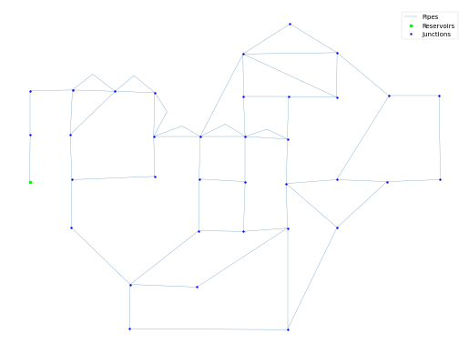
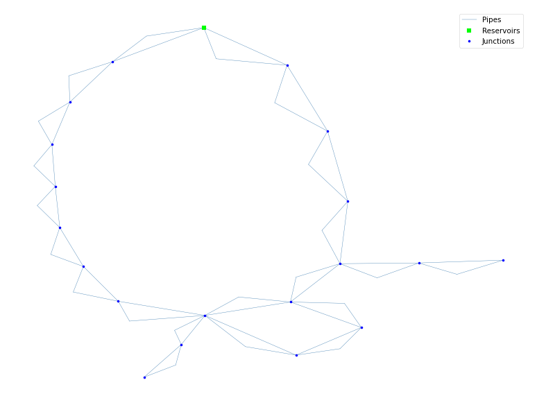
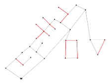
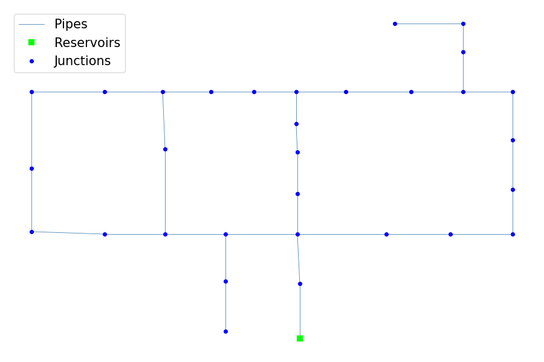
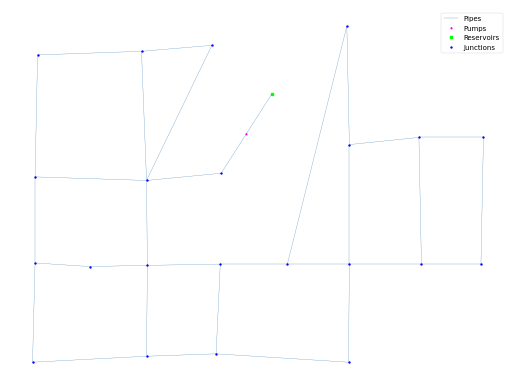

## Overview

The page provides an overview of twelve benchmark design problems of Water Distribution Systems.

<table class="table table-striped">
<caption>
<strong>Note:</strong> LC-number of loading conditions; WS-number of water sources; DV-number of decision variables; PD-number of pipe diameter options.
*For TRN problem, three existing pipes have 8 diameter options for duplication and 2 extra options, i.e. cleaning and leaving alone.
</caption>
<thead>
<tr>
<th>Type</th>
<th>Problem</th>
<th>#LC</th>
<th>#WS</th>
<th>#DV</th>
<th>#PD</th>
<th>Search Space</th>
</tr>
</thead>
<tbody>
<tr>
    <th rowspan=3 style="vertical-align : middle;text-align:center;">Small problems</th>
    <td><a href="#TRN">Two-Reservoir Network (TRN)</a></td>
    <td>3</td>
    <td>2</td>
    <td>8</td>
    <td>8*</td>
    <td>3.28 &times; 107</td>
</tr>
<tr>
    <td><a href="#TLN">Two-Loop Network (TLN)</a></td>
    <td>1</td>
    <td>1</td>
    <td>8</td>
    <td>14</td>
    <td>1.48 &times; 109</td>
</tr>
<tr>
    <td><a href="#BAK">BakRyan Network (BAK)</a></td>
    <td>1</td>
    <td>1</td>
    <td>9</td>
    <td>11</td>
    <td>2.36 &times; 109</td>
</tr>
<tr>
    <th rowspan=4 style="vertical-align : middle;text-align:center;">Medium problems</th>
    <td><a href="#NYT">New York Tunnel Network (NYT)</a></td>
    <td>1</td>
    <td>1</td>
    <td>21</td>
    <td>16</td>
    <td>1.93 &times; 1025</td>
</tr>
<tr>
    <td><a href="#BLA">Blacksburg Network (BLA)</a></td>
    <td>1</td>
    <td>1</td>
    <td>23</td>
    <td>14</td>
    <td>2.30 &times; 1026</td>
</tr>
<tr>
    <td><a href="#HAN">Hanoi Network (HAN)</a></td>
    <td>1</td>
    <td>1</td>
    <td>34</td>
    <td>6</td>
    <td>2.87 &times; 1026</td>
</tr>
<tr>
    <td><a href="#GOY">GoYang Network (GOY)</a></td>
    <td>1</td>
    <td>1</td>
    <td>30</td>
    <td>8</td>
    <td>1.24 &times; 1027</td>
</tr>
</tbody>
</table>

## Problem Formulation

Two objectives are considered, **minimisation of the total capital cost** associated with pipe components and **maximisation of the network resilience**.
The mathematical expression of each objective is given in Eq.\eqref{eq:cost} and Eq. \eqref{eq:resilience}, respectively.

\begin{equation}
\min C = \sum_{i=1}^{np} U_c(D_i) \cdot L_i
\label{eq:cost}
\end{equation}
where $$C$$=total cost (monetary units problem dependant); $$np$$=number of pipes; $$U_c$$=unit pipe cost depending on the diameter selected in a specific problem; $$D_i$$=diameter of pipe $$i$$; $$L_i$$=length of pipe $$i$$.

\begin{equation}
\max I_n = \frac{\sum_{j=1}^{np} C_j Q_J(H_j-H_j^{req})}{\left( \sum_{k=1}^{ny} Q_k H_k + \sum_{i=1}^{npu} \frac{P_i}{\gamma}\right) - \sum_{j=1}^{nn} Q_j H_j^{req}} \quad C_j = \frac{\sum_{i=1}^{npj} D_i}{npj \cdot \max \{D_i\}}
\label{eq:resilience}
\end{equation}
where $$I_n$$=network resilience; $$nn$$=number of demand nodes; $$C_j$$, $$Q_j$$, $$H_j$$ and $$H_j^{req}$$=uniformity, demand, actual head and minimum head of node $$j$$; $$nr$$=number of reservoirs; $$Q_k$$ and $$H_k$$=discharge and actual head of reservoir $$k$$; $$npu$$=number of pumps; $$P_i$$=power of pump $$i$$ if any; $$\gamma$$=specific weight of water; $$npj$$=number of pipes connected to node $$j$$; $$D_i$$=diameter of pipe $$i$$ connected to demand node $$j$$.

## Small problems

  
<h4 style="display:inline-block">Two-Reservoir Network (TRN)</h4>

  The <a href="network-TRN.html">TRN</a> has eight undetermined pipes and nine prefixed pipes, two reservoirs fixed at 365.76 m (left) and 371.86 m (right) and nine demand nodes. New and cleaned pipes have the same Hazen-Williams roughness coefficient of 120.
  The minimum pressure of all the nodes under three demand patterns is specified in Table TRN.1.
  The decision variables are the pipe diameters for five new pipes and alternative options (duplication or cleaning or leaving alone) for three existing pipes
  Each pipe has eight diameter options to choose from. Table TRN.2 shows available options for pipe diameter and the corresponding unit costs. Figure TRN.1 depicts the layout of TRN.

  

  
   

  

  
   

  <figure>
    
    <figcaption>Figure TRN.1: Layout of Two-Reservoir Network.</figcaption>
  </figure>

  
<h4 style="display:inline-block">Two-Loop Network (TLN)</h4>

  The <a href="network-TLN.html">TLN</a> consists of one reservoir, six demand nodes and eight pipes organised in two loops. The reservoir has a constant head fixed at 210 m. As a hypothetical network, all pipes have the same length (1000 m) and the Hazen-Williams coefficient of 130. The pressure is set to be at least 30.0 m at all demand nodes. Table TLN.1 shows commercially available diameters and the corresponding unit costs (1 in.=0.0254 m). Figure TLN.1 depicts the layout of TLN.

  

  
   

  <figure>
    
    <figcaption>Figure TLN.1: Layout of Two Loop Network.</figcaption>
  </figure>

  
<h4 style="display:inline-block">BakRyan Network (BAK)</h4>

  The <a href="network-BAK.html">BAK</a> has fifty-eight pipes including nine new pipes to be sized, thirty-five demand nodes, one reservoir with a fixed head of 58 m. The Hazen-Williams roughness coefficient for each new pipe is 100. The minimum pressure head above the ground elevation of each node is 15 m. Among the new pipes, six of them are parallel. Table BAK.1 shows commercially available diameters and the corresponding unit costs. Figure BAK.1 depicts the layout of BAK.

  

  
   

  <figure>
    
    <figcaption>Figure BAK.1: Layout of BakRyan Network.</figcaption>
  </figure>

## Medium problems

  
<h4 style="display:inline-block">New York Tunnel Network (NYT)</h4>

  The <a href="network-NYC-Tunnel.html">TLN</a> The NYT is comprised of twenty-one pipes organised in two loops, nineteen demand nodes, and one reservoir with a fixed head of 300 ft (1 ft=0.3048 m). All the existing pipes are considered for duplication in order to meet the projected future demand. The Hazen-Williams roughness coefficient for both new and existing pipes is 100. The minimum pressure of all demand nodes is fixed at 255 ft except for node 16 and 17 that are 260 ft and 272.8 ft, respectively. A selection of fifteen diameter sizes are available as well as a ‘do nothing’ option. Table NYT.1 shows the diameter options and associated unit costs. Figure NYT.1 depicts the layout of NYT.

  

  
   

  <figure>
    
    <figcaption>Figure NYT.1: Layout of the New Tork Tunnel Network.</figcaption>
  </figure>

  
<h4 style="display:inline-block">Blacksburg Network (BLA)</h4>

  The <a href="benchmarks/network-blacksburg.html">BLA</a> Blacksburg Network (BLA) consists of thirty-five pipes of which twelve have fixed diameters, one reservoir with a fixed head of 715.56 m, and thirty demand nodes. A universal Hazen-Williams coefficient of 120 is applied to all the pipes under consideration. The pressure requirement of each node is limited within a specified range under the single loading condition. The minimum pressure head for each node is 30 m, while the maximum pressure head varies from node to node and is provided in Table BLA.1. Table BLA.2 shows commercially available diameters and the corresponding unit costs. Figure 5 depicts the layout of BLA.

  

  
   

  

  
   

  <figure>
    
    <figcaption>Figure BLA.1: Layout of the Blacksburg Network.</figcaption>
  </figure>

  
<h4 style="display:inline-block">Hanoi Network (HAN)</h4>

  The <a href="benchmarks/network-Hanoi.html">HAN</a> Hanoi network consists of thirty-four pipes organised in three loops, thirty-one demand nodes and one reservoir with a fixed head of 100 m. The Hazen-Williams roughness coefficient for all pipes is 130. The minimum head above the ground elevation of each node is 30 m. There are six commercially available pipe sizes, ranging from 12 in. to 40 in. (1 in.=0.0254 m). Table HAN.1 shows the diameter options and associated unit costs. Figure HAN.1 depicts the layout of HAN.

  

  
   

  <figure>
    
    <figcaption>Figure HAN.1: Layout of the Hanoi Network.</figcaption>
  </figure>

  
<h4 style="display:inline-block">GoYang Network (GOY)</h4>

  The <a href="benchmarks/network-GOY.html">GOY</a> GoYang Network includes thirty pipes, twenty-two demand nodes, and one constant pump of 4.52 kW linking to one reservoir with a constant head of 71 m. The Hazen-Williams roughness coefficient for each new pipe is 100. The minimum pressure head above the ground elevation of each node is 15 m. Table GOY.1 shows commercially available diameters and the corresponding unit costs. Figure GOY.1 depicts the layout of GOY.

  

  
   

  <figure>
    
    <figcaption>Figure GOY.1: Layout of the GoYang Network.</figcaption>
  </figure>

## Intermediate problems

TODO

## Large problems

TODO