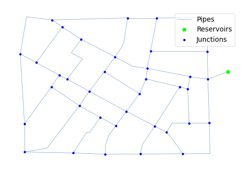
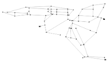

## Overview

The page provides an overview of twelve benchmark design problems of Water Distribution Systems.

<table class="table table-striped">
<caption>
<strong>Note:</strong> LC-number of loading conditions; WS-number of water sources; DV-number of decision variables; PD-number of pipe diameter options.
*For TRN problem, three existing pipes have 8 diameter options for duplication and 2 extra options, i.e. cleaning and leaving alone.
</caption>
<thead>
<tr>
<th>Type</th>
<th>Problem</th>
<th>#LC</th>
<th>#WS</th>
<th>#DV</th>
<th>#PD</th>
<th>Search Space</th>
</tr>
</thead>
<tbody>
<tr>
    <th rowspan=3 style="vertical-align : middle;text-align:center;">Small problems</th>
    <td><a href="#TRN">Two-Reservoir Network (TRN)</a></td>
    <td>3</td>
    <td>2</td>
    <td>8</td>
    <td>8*</td>
    <td>3.28 &times; 107</td>
</tr>
<tr>
    <td><a href="#TLN">Two-Loop Network (TLN)</a></td>
    <td>1</td>
    <td>1</td>
    <td>8</td>
    <td>14</td>
    <td>1.48 &times; 109</td>
</tr>
<tr>
    <td><a href="#BAK">BakRyan Network (BAK)</a></td>
    <td>1</td>
    <td>1</td>
    <td>9</td>
    <td>11</td>
    <td>2.36 &times; 109</td>
</tr>
</tbody>
</table>

## Problem Formulation

Two objectives are considered, **minimisation of the total capital cost** associated with pipe components and **maximisation of the network resilience**.
The mathematical expression of each objective is given in Eq.\eqref{eq:cost} and Eq. \eqref{eq:resilience}, respectively.

\begin{equation}
\min C = \sum_{i=1}^{np} U_c(D_i) \cdot L_i
\label{eq:cost}
\end{equation}
where $$C$$=total cost (monetary units problem dependant); $$np$$=number of pipes; $$U_c$$=unit pipe cost depending on the diameter selected in a specific problem; $$D_i$$=diameter of pipe $$i$$; $$L_i$$=length of pipe $$i$$.

\begin{equation}
\max I_n = \frac{\sum_{j=1}^{np} C_j Q_J(H_j-H_j^{req})}{\left( \sum_{k=1}^{ny} Q_k H_k + \sum_{i=1}^{npu} \frac{P_i}{\gamma}\right) - \sum_{j=1}^{nn} Q_j H_j^{req}} \quad C_j = \frac{\sum_{i=1}^{npj} D_i}{npj \cdot \max \{D_i\}}
\label{eq:resilience}
\end{equation}
where $$I_n$$=network resilience; $$nn$$=number of demand nodes; $$C_j$$, $$Q_j$$, $$H_j$$ and $$H_j^{req}$$=uniformity, demand, actual head and minimum head of node $$j$$; $$nr$$=number of reservoirs; $$Q_k$$ and $$H_k$$=discharge and actual head of reservoir $$k$$; $$npu$$=number of pumps; $$P_i$$=power of pump $$i$$ if any; $$\gamma$$=specific weight of water; $$npj$$=number of pipes connected to node $$j$$; $$D_i$$=diameter of pipe $$i$$ connected to demand node $$j$$.

## Small problems

  
<h4 style="display:inline-block">Two-Reservoir Network (TRN)</h4>

  The <a href="network-TRN.html">TRN</a> has eight undetermined pipes and nine prefixed pipes, two reservoirs fixed at 365.76 m (left) and 371.86 m (right) and nine demand nodes. New and cleaned pipes have the same Hazen-Williams roughness coefficient of 120.
  The minimum pressure of all the nodes under three demand patterns is specified in Table TRN.1.
  The decision variables are the pipe diameters for five new pipes and alternative options (duplication or cleaning or leaving alone) for three existing pipes
  Each pipe has eight diameter options to choose from. Table TRN.2 shows available options for pipe diameter and the corresponding unit costs. Figure TRN.1 depicts the layout of TRN.

  

  
   

  

  
   

  <figure>
    
    <figcaption>Figure TRN.1: Layout of Two-Reservoir Network.</figcaption>
  </figure>

  
<h4 style="display:inline-block">Two-Loop Network (TLN)</h4>

  The <a href="network-TLN.html">TLN</a> consists of one reservoir, six demand nodes and eight pipes organised in two loops. The reservoir has a constant head fixed at 210 m. As a hypothetical network, all pipes have the same length (1000 m) and the Hazen-Williams coefficient of 130. The pressure is set to be at least 30.0 m at all demand nodes. Table TLN.1 shows commercially available diameters and the corresponding unit costs (1 in.=0.0254 m). Figure TLN.1 depicts the layout of TLN.

  

  
   

  <figure>
    
    <figcaption>Figure TLN.1: Layout of Two Loop Network.</figcaption>
  </figure>

  
<h4 style="display:inline-block">BakRyan Network (BAK)</h4>

  The <a href="network-BAK.html">BAK</a> has fifty-eight pipes including nine new pipes to be sized, thirty-five demand nodes, one reservoir with a fixed head of 58 m. The Hazen-Williams roughness coefficient for each new pipe is 100. The minimum pressure head above the ground elevation of each node is 15 m. Among the new pipes, six of them are parallel. Table BAK.1 shows commercially available diameters and the corresponding unit costs. Figure BAK.1 depicts the layout of BAK.

  

  
   

  <figure>
    
    <figcaption>Figure BAK.1: Layout of BakRyan Network.</figcaption>
  </figure>

## Medium problems

TODO

## Intermediate problems

  
<h4 style="display:inline-block">Fossolo Network (FOS)</h4>

  The <a href="network-FOS.html">FOS</a> has fifty-eight pipes, thirty-six demand nodes, and one reservoir with a fixed head of 121.00 m. The material for all the pipes is polyethylene. Due to the feature of polyethylene, a relatively high roughness coefficient of 150 is applied to all the pipes. The minimum pressure head of all the demand nodes is maintained at 40 m, while the maximum pressure head of each node is specified in Table FOS.1. In addition, the flow velocity in each pipe is enforced to be less than or equal to 1 m/s. Table FOS.2 shows commercially available diameters and the corresponding unit costs. Figure FOS.1 depicts the layout of FOS.
  
  

  
   

  

  
   

  <figure>
    
    <figcaption>Figure FOS.1. Layout of Fossolo Network</figcaption>
  </figure>

  
<h4 style="display:inline-block">Pescara Network (PES)</h4>

  The <a href="network-PES.html">PES</a> includes ninety-nine pipes, sixty-eight demand nodes, and three reservoirs with fixed head within 53.08 m to 57.00 m. The pipe material is cast iron. A uniform Hazen-Williams roughness coefficient of 130 is applied to all pipes. The minimum pressure head of all the demand nodes is maintained at 20 m, while the maximum pressure head of each node is specified in Table PES.1. In addition, the flow velocity in each pipe is enforced to be less than or equal to 2 m/s. Table PES.2 shows commercially available diameters and the corresponding unit costs. Figure PES.1 depicts the layout of PES.
  
  

  
   

  

  
   

  <figure>
    
    <figcaption>Figure PES.1. Layout of Pescara Network</figcaption>
  </figure>

## Large problems

TODO