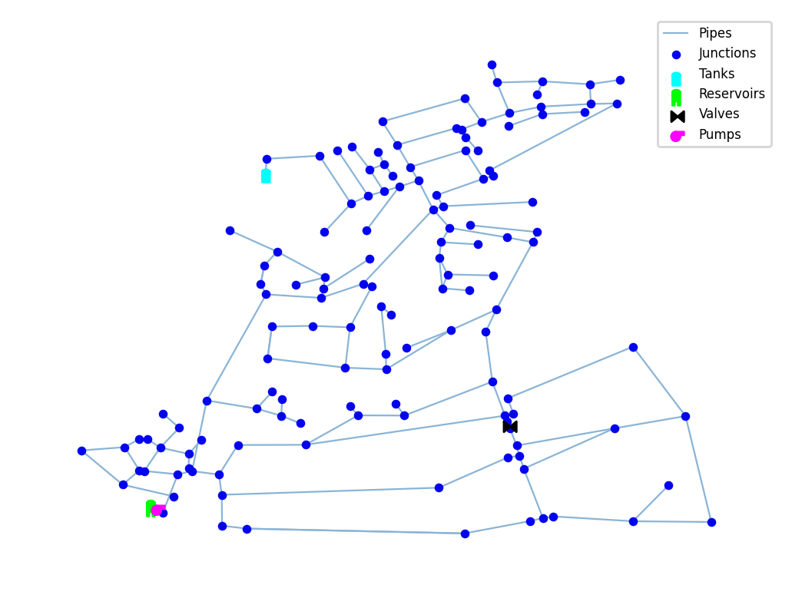

## Description

The `01-uk-style Network` is a demo example network provided by **epanet.js**. It is located in Scotland. 

The network consists of 136 nodes, 153 pipes, 1 valve, 1 reservoir, 1 pump and 1 tank. 

## How to Use

The 01-uk-style Network is provided as an .inp file and can be loaded into EPANET or any other software package supporting .inp files.

## Reference
Example model provided by *epanet.js*: [<i class="bi bi-link"></i>](https://github.com/epanet-js/epanet-js/blob/main/public/example-models/01-uk-style.inp)
