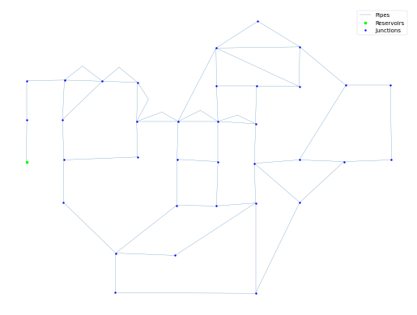

## Description

A system designed to test new algorithms for network design.

The network consists of 36 nodes, 58 pipes and 1 reservoir.




## How to Use

The BAK network is provided as an .inp file and can be loaded into EPANET or any other software package
supporting .inp files.

### Usage in Python

The BAK network is also available in Python through the key "*Network-BAK*":
```python
network = load("Network-BAK")
bak_inp = network.load()
```

Detailed information about the provided functionality can be found in the documentation of
[`load()`](https://waterbenchmarkhub.readthedocs.io/en/latest/water_benchmark_hub.networks.html#water_benchmark_hub.networks.networks.BAK.load).


## Reference

Naga Poojitha, Seelam & Jothiprakash, Vinayakam & Sivakumar, B.. (2021). Chaos-Directed Genetic Algorithms for Water Distribution Network Design: An Enhanced Search Method.
[<i class="bi bi-link"></i>](http://dx.doi.org/10.21203/rs.3.rs-574714/v1)

