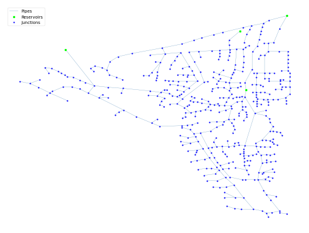

## Description

A network for researching genetic algorithms for the design of looped irrigation water distribution networks.

The network consists of 447 nodes, 454 pipes, 4 reservoirs.




## How to Use

The BIN network is provided as an .inp file and can be loaded into EPANET or any other software package
supporting .inp files.

### Usage in Python

The BIN network is also available in Python through the key "*Network-BIN*":
```python
network = load("Network-BIN")
bin_inp = network.load()
```

Detailed information about the provided functionality can be found in the documentation of
[`load()`](https://waterbenchmarkhub.readthedocs.io/en/latest/water_benchmark_hub.networks.html#water_benchmark_hub.networks.networks.BIN.load).


## Reference

Reca, Juan; Martínez, Juan. Genetic algorithms for the design of looped irrigation water distribution networks. Water resources research, 2006, 42. Jg., Nr. 5.
[<i class="bi bi-link"></i>](https://doi.org/10.1029/2005WR004383)

