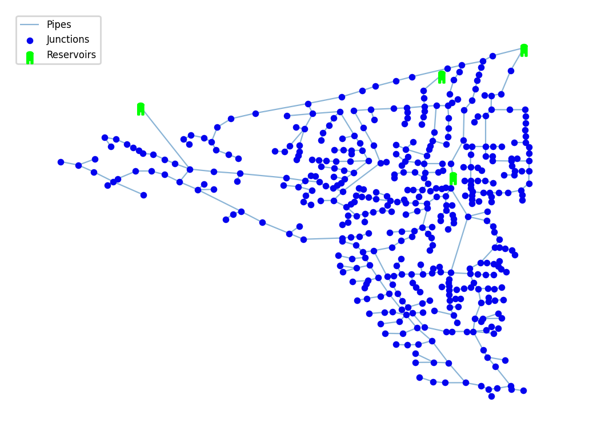

## Description
A standard benchmark water distribution network based on the Sol‑Poniente district in Almería, Spain, the `Balerma Irrigation Network` is widely used for optimization studies, including research on genetic algorithms for designing looped irrigation water distribution systems.

The network consists of 447 nodes, 454 pipes and 4 reservoirs.




## How to Use

Balerma Irrigation Network is provided as an .inp file and can be loaded into EPANET or any other software package supporting .inp files.

### Usage in Python

Balerma Network is also available in Python through the key "*Network-Balerma*":
```python
network = load("Network-Balerma")
balerma_inp = network.load()
```

Detailed information about the provided functionality can be found in the documentation of
[`load()`](https://waterbenchmarkhub.readthedocs.io/en/latest/water_benchmark_hub.networks.html#water_benchmark_hub.networks.networks.Balerma.load).


## Costs in the Network Design Problem

Diameter options and associdated costs:

<div id="tab-diameter-costs"></div>
<script type="text/javascript">insertTable("tab-diameter-costs", "../static/benchmarks/network-balerma/balerma_Cost.csv");</script>
<br>


## Reference

Reca, J. and Martínez, J., 2006. Genetic algorithms for the design of looped irrigation water distribution networks. Water resources research, 42(5).
DOI: 10.1029/2005WR004383. 
[<i class="bi bi-link"></i>](https://doi.org/10.1029/2005WR004383)
