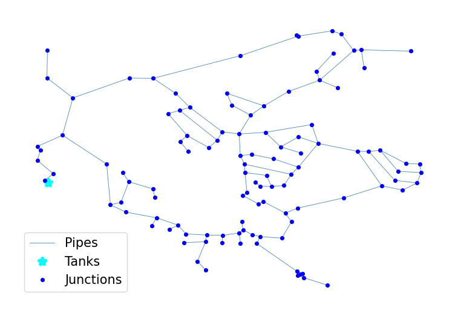

## Description

The CA1 system is based on the Fairfield, CA Distribution system and was originally used by Rossman et al. in 1996 as
part of a study into numerical modelling methods. The system has a total demand of 0.62 MGD, one tank, and 11.1 miles
of pipe. It is classified as distribution dense-grid by Hwang & Lansey (2017) and gridded by Hoagland et al. (2015).

It was published 2016 by University of Kentucky Libraries.

The network consists of 111 nodes (junctions), 126 pipes, and 1 tank. It contains a demand pattern for one day.



## How to Use

The CA1 network is provided as an .inp file and can be loaded into EPANET or any other software package
supporting .inp files.

### Usage in Python

The CA1 network is also available in Python through the key "*Network-CA1*":
```python
network = load("Network-CA1")
ca1_inp = network.load()
```

Detailed information about the provided functionality can be found in the documentation of
[`load()`](https://waterbenchmarkhub.readthedocs.io/en/latest/water_benchmark_hub.networks.html#water_benchmark_hub.networks.networks.CA1.load).


## Reference

Boccelli, Dominic L., "01 CA 1" (2016). US Systems. 1.
[<i class="bi bi-link"></i>](https://uknowledge.uky.edu/wdst_us/1)

Rossman, L.A. and Boulos, P.F., 1996. *Numerical methods for modeling water quality in distribution systems: A
comparison.* Journal of Water Resources planning and management, 122(2), pp.137-146.
[<i class="bi bi-link"></i>](https://doi.org/10.1061/(ASCE)0733-9496(1996)122:2(137))

Vasconcelos, J.J., Rossman, L.A., Grayman, W.M., Boulos, P.F. and Clark, R.M., 1997. *Kinetics of chlorine decay.*
Journal-American Water Works Association, 89(7), pp.54-65.
[<i class="bi bi-link"></i>](https://doi.org/10.1002/j.1551-8833.1997.tb08259.x)
