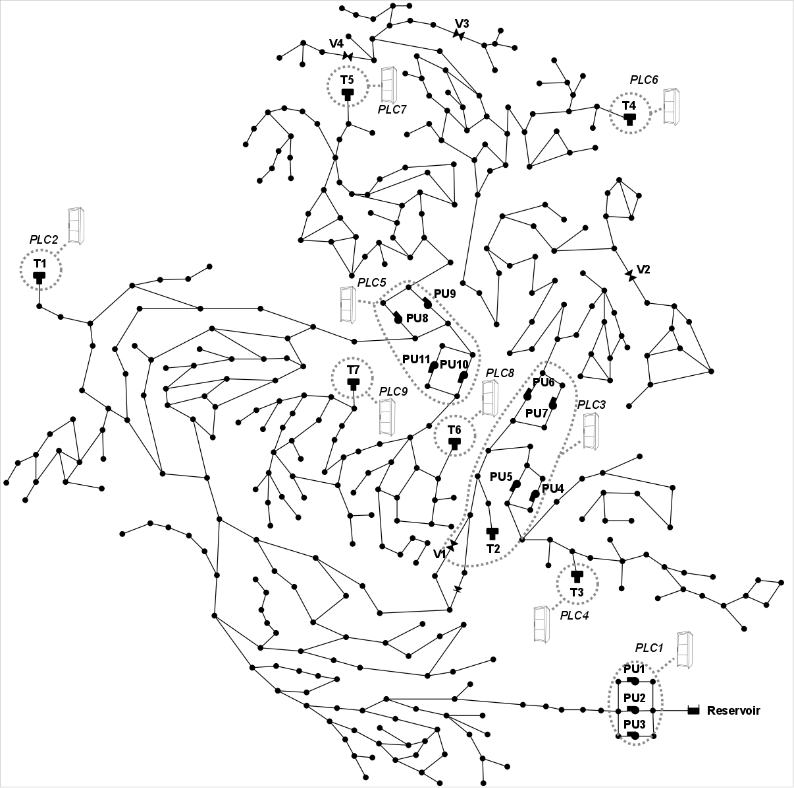

## Description

The Calibration Network system serves the hypothetical town C-Town and was created by
Avi Ostfield et al. in 2011 as part of the
[Battle of the Water Calibration Networks (BWCN)](BWCN.html) competition.
The C-Town network was also used susequent competitions such as the
[BATADAL competition](BATADAL.html) and [BBLAWN competition](BBLAWN.html).

The network consists of 388 junctions, 444 pipes, 1 reservoir, 7 tanks, 11 pumps, and 4 valves.



## How to Use

C-Town is provided as an .inp file and can be loaded into EPANET or any other software package
supporting .inp files.

### Usage in Python

C-Town is also available in Python through the key "*Network-CTown*":
```python
network = load("Network-CTown")
ctown_inp = network.load()
```

Detailed information about the provided functionality can be found in the documentation of
[`load()`](https://water-benchmark-hub.readthedocs.io/en/stable/water_benchmark_hub.networks.html#water_benchmark_hub.networks.networks.CTown.load).


## Reference

Avi Ostfeld, Elad Salomons, Lindell Ormsbee, James G. Uber, Christopher M. Bros, Paul Kalungi,
Richard Burd, Boguslawa Zazula-Coetzee, Teddy Belrain, Doosun Kang, Kevin Lansey, Hailiang Shen,
Edward McBean, Zheng Yi Wu, Tom Walski, Stefano Alvisi, Marco Franchini, Joshua P. Johnson,
Santosh R. Ghimire, Brian D. Barkdoll, Tiit Koppel, Anatoli Vassiljev, Joong Hoon Kim,
Gunhui Chung, Do Guen Yoo, Kegong Diao, Yuwen Zhou, Ji Li, Zilong Liu, Kui Chang, Jinliang Gao,
Shaojian Qu, Yixing Yuan, T. Devi Prasad, Daniele Laucelli, Lydia S. Vamvakeridou Lyroudia,
Zoran Kapelan, Dragan Savic, Luigi Berardi, Giuseppe Barbaro, Orazio Giustolisi, Masoud Asadzadeh,
Bryan A. Tolson, and Robert McKillop (2012).
*Battle of the water calibration networks.* Journal of water resources planning and management,
138(5).
[<i class="bi bi-link"></i>](https://doi.org/10.1061/(ASCE)WR.1943-5452.0000191)
