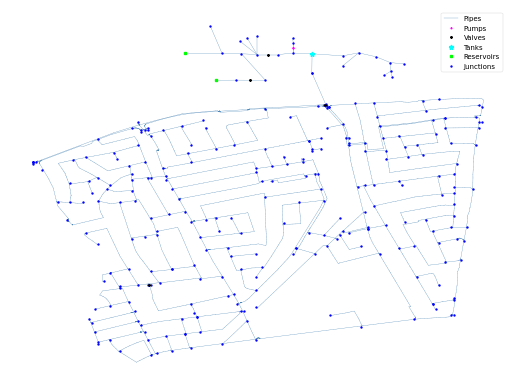

## Description

The CY-DBP network is based on a realistic system in Cyprus and modified for security purposes.
The network comprises a District Metered Area (DMA) level distribution network with 31.2 km of
pipes that serves a residential area of approximately 12000 people and has a daily average demand
of 1800 m^3. The system can receive water from a Drinking Water Treatment Plant (DWTP) and from a
Desalination Plant during periods with low surface water reserves or mixed water from both sources.
This network was developed through the EPANET hydraulic simulator by utilizing GIS and CAD data.
Consumer billing data, flow, and pressure measurements acquired from the SCADA system were utilized
to model the consumer demands and to calibrate the hydraulics of the network.

The network consists of 284 junctions, 357 pipes, 2 pumps, 4 valves, 2 reservoirs, and 1 tank.
It also contains a demand pattern for approx. 1 week.



## How to Use

CY-DBP is provided as an .inp file and can be loaded into EPANET or any other software package
supporting .inp files.

### Usage in Python

CY-DBP is also available in Python through the key "*Network-CY-DBP*":
```python
network = load("Network-CY-DBP")
cydbp_inp = network.load()
```

Detailed information about the provided functionality can be found in the documentation of
[`load()`](https://waterbenchmarkhub.readthedocs.io/en/latest/water_benchmark_hub.networks.html#water_benchmark_hub.networks.networks.CYDBP.load).


## Reference

Pavlou, Pavlos, Marios Kyriakou, Stelios G. Vrachimis, and Demetrios G. Eliades. (2024).
*A Comprehensive Virtual Testbed for Modeling Disinfection Byproduct Formation in Water Distribution Networks*
Engineering Proceedings 69, no. 1: 33.
[<i class="bi bi-link"></i>](https://doi.org/10.3390/engproc2024069033)
