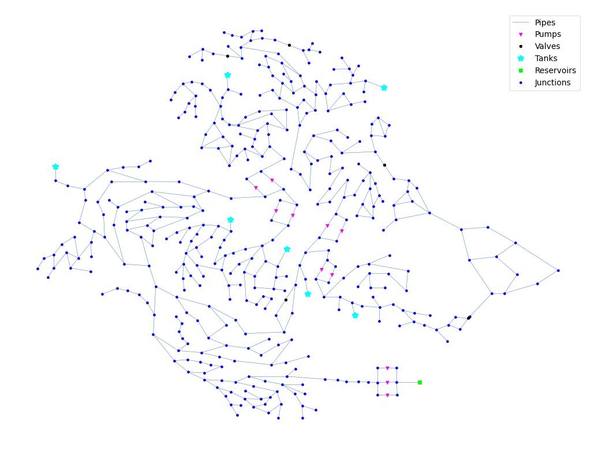

## Description

The objective of the D-Town network problem is to determine the best long-term design improvements given projected
future water demand and development of a new area. This analysis takes into account capital and operational costs,
greenhouse gas (GHG) emissions and water age.

The D-Town network consists of five existing district metered areas (DMAs) requiring upgrades and an additional new zone
to be designed. It formed part of the [BWN-II](BWN2.html) competition.

The D-Town network consists of 399 junctions, 7 storage tanks, 443 pipes, 11 pumps and 5 valves, and a single reservoir.

The network also contains a demand pattern for one week.



## How to Use

D-Town is provided as an .inp file and can be loaded into EPANET or any other software package
supporting .inp files.

### Usage in Python

D-Town is also available in Python through the key "*Network-DTown*":
```python
network = load("Network-DTown")
dtown_inp = network.load()
```

Detailed information about the provided functionality can be found in the documentation of
[`load()`](https://waterbenchmarkhub.readthedocs.io/en/latest/water_benchmark_hub.networks.html#water_benchmark_hub.networks.networks.DTown.load).


## Reference

Marchi, A., Salomons, E., Ostfeld, A., Kapelan, Z., Simpson, A., Zecchin, A., Maier, H., Wu, Z., Elsayed, S., Song, Y.,
Walski, T., Stokes, C., Wu, W., Dandy, G., Alvisi, S., Creaco, E., Franchini, M., Saldarriaga, J., Páez, D., Hernández,
D., Bohórquez, J., Bent, R., Coffrin, C., Judi, D., McPherson, T., van Hentenryck, P., Matos, J., Monteiro, A., Matias,
N., Yoo, D., Lee, H., Kim, J., Iglesias-Rey, P., Martínez-Solano, F., Mora-Meliá, D., Ribelles-Aguilar, J., Guidolin,
M., Fu, G., Reed, P., Wang, Q., Liu, H., McClymont, K., Johns, M., Keedwell, E., Kandiah, V., Jasper, M., Drake, K.,
Shafiee, E., Barandouzi, M., Berglund, A., Brill, D., Mahinthakumar, G., Ranjithan, R., Zechman, E., Morley, M.,
Tricarico, C., de Marinis, G., Tolson, B., Khedr, A., and Asadzadeh, M.
(2013). “The Battle of the Water Networks II (BWN-II).” Journal of Water Resources Planning and Management in press.
doi:10.1061/(ASCE)WR.1943-5452.0000378.
[<i class="bi bi-link"></i>](http://ascelibrary.org/doi/abs/10.1061/%28ASCE%29WR.1943-5452.0000378)

