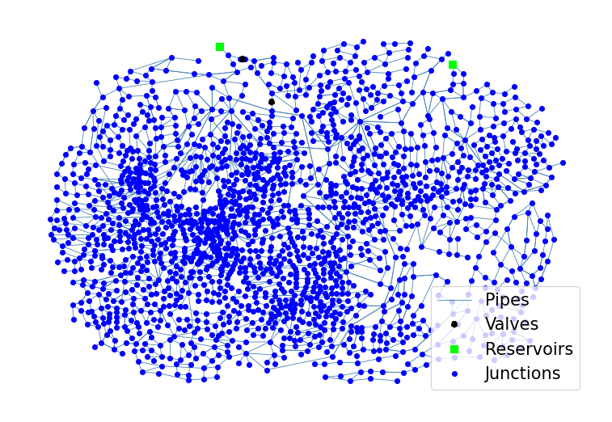

## Description

A benchmark system for optimization models.

The network consists of 1893 nodes, 3029 pipes, 2 reservoirs and 2 valves.




## How to Use

The EXN network is provided as an .inp file and can be loaded into EPANET or any other software package
supporting .inp files.

### Usage in Python

The EXN network is also available in Python through the key "*Network-EXN*":
```python
network = load("Network-EXN")
exn_inp = network.load()
```

Detailed information about the provided functionality can be found in the documentation of
[`load()`](https://waterbenchmarkhub.readthedocs.io/en/latest/water_benchmark_hub.networks.html#water_benchmark_hub.networks.networks.EXN.load).


## Reference
Farmani, R., Savic, D. A., & Walters, G. A. (2004). *Exnet benchmark problem for multi-objective optimization of large water systems.* Modelling and control for participatory planning and managing water systems.
