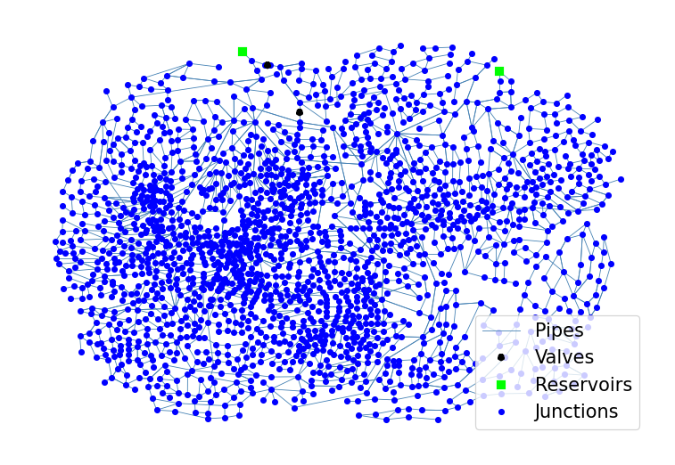

## Description

This benchmark water system has been set up by the Centre for Water Systems of Exeter University as a realistic challenging problem. The aim is to determine the most economically effective design to reinforce the existing system to meet projected demands as a network. The network serves a population of approximately 400,000. It consists of relatively small pipes and few transmission mains, with a large head-loss range at the extremities of the system, making it highly sensitive to demand increases.

The network consists of 1893 nodes, 3029 pipes, 2 reservoirs and 2 valves.




## How to Use

The EXN network is provided as an .inp file and can be loaded into EPANET or any other software package
supporting .inp files.

### Usage in Python

The EXN network is also available in Python through the key "*Network-EXN*":
```python
network = load("Network-EXN")
exn_inp = network.load()
```

Detailed information about the provided functionality can be found in the documentation of
[`load()`](https://waterbenchmarkhub.readthedocs.io/en/latest/water_benchmark_hub.networks.html#water_benchmark_hub.networks.networks.EXN.load).


### Design Problem Description
Exeter network has three thousand and thirty-two pipes including five hundred and sixty-seven considered for duplication, five valves, one thousand eight hundred and ninety-one junction nodes and seven water sources. Two major reservoirs (node 3001 and 3002) supply water to the system at fixed head of 58.4 m and 62.4 m respectively. The system is also fed by its neighbour systems via node 3003 to 3007 at fixed rates. Three non-return valves (also known as check valves) are connected to node 3001 and 3002 to control the flow direction into and outside the system. One pressure reducing valve locates in the downstream of node 3004 to maintain the downstream pressure within 58.4 m. One throttle control valve is also in the link downstream of node 3004 to control the flow and pressure of system.

The minimum pressure requirement of demand nodes is 20.0 m. There are ten available discrete pipe sizes and one extra option as 'do nothing'. The unit cost for duplicating the existing pipe depends on both the diameter selected and the road type. Table EXN.1 shows the pipe diameters, the corresponding Colebrook-White friction factors (following Darcy-Weisbach formula) and unit costs. The location of major roads is specified in Table EXN.2 in terms of pipe ID. Figure EXN.1 depicts the layout of EXN.

Diameter options, Roughness, major road and minor road associdated costs:

<div id="Table-EXN1"></div>
<script type="text/javascript">insertTable("Table-EXN1", "../static/benchmarks/network-exn/EXN_Cost.csv");</script>
<br>

Major Road Details:

<div id="Table-EXN2"></div>
<script type="text/javascript">insertTable("Table-EXN2", "../static/benchmarks/network-exn/EXN_MajorRoad.csv");</script>
<br>


## Reference
Farmani, R., Savic, D. A., & Walters, G. A. (2004). *Exnet benchmark problem for multi-objective optimization of large water systems.* Modelling and control for participatory planning and managing water systems.
