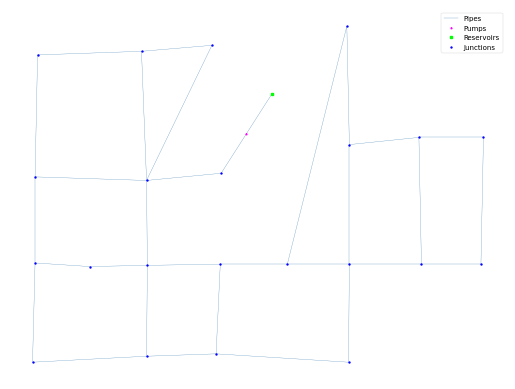

## Description

A network designed for researching network system design using non-linear programming.

The network consists of 23 nodes, 30 pipes, 1 pump and 1 reservoir.




## How to Use

The GOY network is provided as an .inp file and can be loaded into EPANET or any other software package
supporting .inp files.

### Usage in Python

The GOY network is also available in Python through the key "*Network-GOY*":
```python
network = load("Network-GOY")
goy_inp = network.load()
```

Detailed information about the provided functionality can be found in the documentation of
[`load()`](https://waterbenchmarkhub.readthedocs.io/en/latest/water_benchmark_hub.networks.html#water_benchmark_hub.networks.networks.GOY.load).


## Reference
KIM, J. H., et al. *A study on the pipe network system design using non-linear programming.* J. Korean Water Resour. Assoc, 1994, 27. Jg., Nr. 4, S. 59-67.
