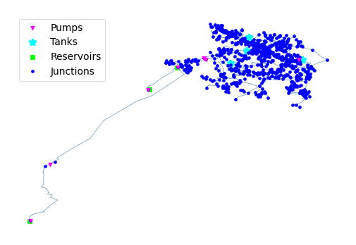

## Description

The KY 16 system is based on a real-world system in KY and was originally used by Jolly et al. in 2014 as part of a
classification study. The system has a total demand of 2.0 MGD, three reservoirs, four tanks, seven pumps, and 103 miles
of pipe. It is classified as distribution hybrid by Hwang & Lansey (2017) and looped by Hoagland et al. (2015).

It was published 2021 by University of Kentucky Libraries.

The network consists of 777 nodes (junctions), 907 pipes, 4 tanks, 7 pumps and 3 reservoirs. It contains a demand
pattern for one day.



## How to Use

The KY16 network is provided as an .inp file and can be loaded into EPANET or any other software package
supporting .inp files.

### Usage in Python

The KY16 network is also available in Python through the key "*Network-KY16*":
```python
network = load("Network-KY16")
ky16_inp = network.load()
```

Detailed information about the provided functionality can be found in the documentation of
[`load()`](https://waterbenchmarkhub.readthedocs.io/en/latest/water_benchmark_hub.networks.html#water_benchmark_hub.networks.networks.KY16.load).


## Reference

Hoagland, Steven, "16 KY 16" (2021). Kentucky Dataset. 36.
[<i class="bi bi-link"></i>](https://uknowledge.uky.edu/wdst/36)

Jolly, M. D., Lothes, A. D., Bryson, L. S., & Ormsbee, L. (2014). *Research Database of Water Distribution System Models.*
Journal of Water Resources Planning and Management, 410-416. 10.1061/(ASCE)WR.1943-5452.0000352
[<i class="bi bi-link"></i>](https://doi.org/10.1061/(ASCE)WR.1943-5452.0000352)
