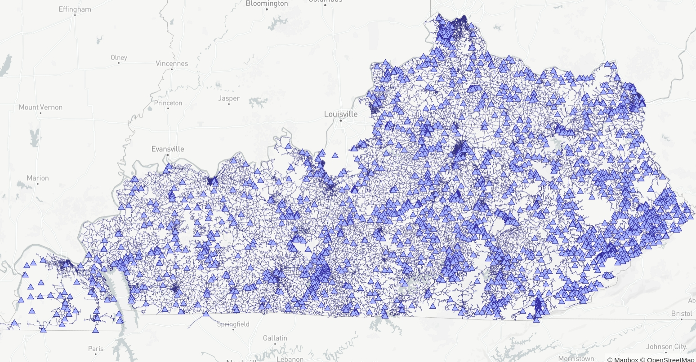

## Description

The KY-ALL system is based on the entire water distribution system in Kentucky and was originally published by Luke Butler as part of a
performance stress testing of *epanet-js*.

The network consists of 317947 nodes (junctions), 352378 pipes, 2653 tanks, 4703 pump and 2653 reservoir.

<figure>

<figcaption><small>Screenshot from epanet-js</small></figcaption>
</figure>

## Reference

Luke Butler, *epanet-js* (2026)
