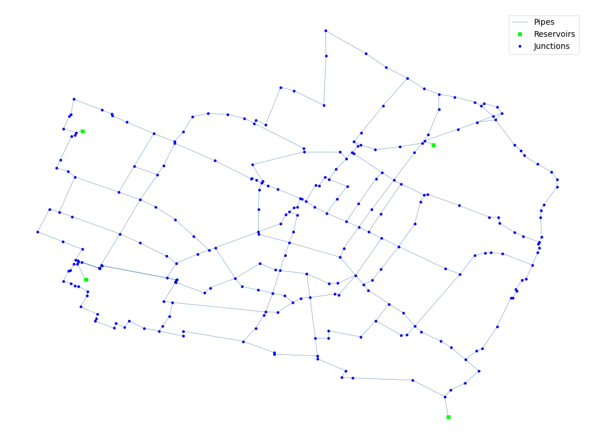

## Description

The Modena system is based on the water distribution system in Modena, Italy and was originally developed by Bragalli et
al. in 2008 as part of a design optimization study. The system has a total demand of 53,000 CMD, four reservoirs, and 72
km of pipe. It is classified as distribution dense-grid by Hwang & Lansey (2017) and looped by Hoagland et al. (2015).

It was published 2021 by University of Kentucky Libraries.

The network consists of 268 nodes (junctions), 317 pipes and 4 reservoirs.



## How to Use

The Modena network is provided as an .inp file and can be loaded into EPANET or any other software package
supporting .inp files.

### Usage in Python

The Modena network is also available in Python through the key "*Network-Modena*":
```python
network = load("Network-Modena")
modena_inp = network.load()
```

Detailed information about the provided functionality can be found in the documentation of
[`load()`](https://water-benchmark-hub.readthedocs.io/en/stable/water_benchmark_hub.networks.html#water_benchmark_hub.networks.networks.Modena.load).


## Reference

Hall, Ashley, "05 Modena" (2021). International Systems. 5.
[<i class="bi bi-link"></i>](https://uknowledge.uky.edu/wdst_international/5)

Bragalli, C. Ambrosio, D., Lee, J., Lodi, A., Toth, P. 2008. *IBM Research Report: Water Network Design by MINLP.* RC24495
(W0802-056)
[<i class="bi bi-link"></i>](https://dominoweb.draco.res.ibm.com/ef1b90113cc7b03a852573fc00529261.html)

Creaco, E. and Franchini, M. (2014) *Low level hybrid procedure for the multi-objective design of water distribution
networks*, Procedia Engineering 70, 369 – 378
[<i class="bi bi-link"></i>](https://doi.org/10.1016/j.proeng.2014.02.042)

Bi, W., Dandy, G. C. and Maier, H. R. (2015) *Improved genetic algorithm optimization of water distribution system design
by incorporating domain knowledge*, Environmental Modelling & Software, Vol. 69, 370-381.
[<i class="bi bi-link"></i>](https://doi.org/10.1016/j.envsoft.2014.09.010)
