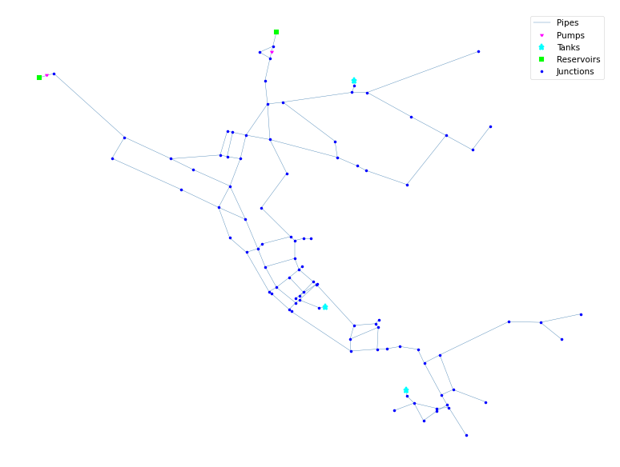

## Description

The EPANET Example Network 3 (short `Net3`) constitutes a simple example of modeling chlorine decay.
Both bulk and wall reactions are included.

The network consists of 91 junctions, 121 pipes, 3 tanks, 2 pumps and 2 reservoirs. It contains a demand pattern for 1 day.



## How to Use

Net3 is provided as an .inp file and can be loaded into EPANET or any other software package
supporting .inp files.

### Usage in Python

Net3 is also available in Python through the key "*Network-Net3*":
```python
network = load("Network-Net3")
net3_inp = network.load()
```

Detailed information about the provided functionality can be found in the documentation of
[`load()`](https://waterbenchmarkhub.readthedocs.io/en/latest/water_benchmark_hub.networks.html#water_benchmark_hub.networks.networks.Net3.load).


## Reference

Clark, Robert M., Lewis A. Rossman, and Larry J. Wymer. (1995). Modeling distribution system water quality: Regulatory
implications. Journal of water resources planning and management, 121(6), 423-428.
DOI: 10.1061/(ASCE)0733-9496(1995)121:6(423).
[<i class="bi bi-link"></i>](https://doi.org/10.1061/(ASCE)0733-9496(1995)121:6(423))

Rossman, L. A. (2000). *EPANET 2: users manual.*
[<i class="bi bi-link"></i>](https://www.engr.colostate.edu/CIVE572/Projects/PROJ%202-Urban%20Water%20Dist%20System%20Analysis/EN2manual.pdf)
