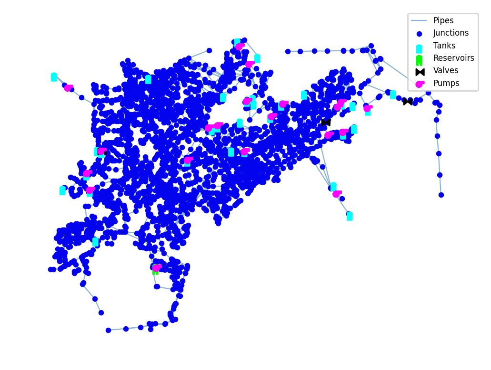

## Description

The network `Net6` is a synthetic water distribution network used in research on robust sensor placement for detecting high‑impact contamination events. 

The network consists of 3322 junctions, 3828 pipes, 60 pumps, 2 valves, 33 tanks and one reservoir. 



## How to Use

Net6 is provided as an .inp file and can be loaded into EPANET or any other software package supporting .inp files.

### Usage in Python

Net6 is also available in Python through the key "*Network-Net6*":
```python
network = load("Network-Net6")
net6_inp = network.load()
```

Detailed information about the provided functionality can be found in the documentation of
[`load()`](https://waterbenchmarkhub.readthedocs.io/en/latest/water_benchmark_hub.networks.html#water_benchmark_hub.networks.networks.Net6.load).


## Reference

Jean-Paul Watson, Regan Murray, William E. Hart (2009). Formulation and Optimization of Robust Sensor Placement Problems for Drinking Water Contamination Warning Systems. Journal of Infrastructure Systems, 15(4), 330-339. 
DOI: 10.1061/(ASCE)1076-0342(2009)15:4(330). 
[<i class="bi bi-link"></i>](https://doi.org/10.1061/(ASCE)1076-0342(2009)15:4(330))

