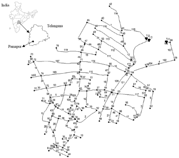

## Description
The Pamapur WDN (real-life case study located in Telangana, India) consists of 122 pipes, 102 demand nodes, and three tanks originally modified for Multi-objective WDS design optimization problem as shown in Pankaj et al 2020. 

## How to Use

The Pamapur network is provided as an .inp file and can be loaded into EPANET or any other software package supporting .inp files. 

For the WDS design problem, the tanks are modified as reservoirs for simplifying the problem.

## Reference

Pankaj, B. Sriman, et al. "Self-adaptive cuckoo search algorithm for optimal design of water distribution systems." Water Resources Management 34.10 (2020): 3129-3146.
[<i class="bi bi-link"></i>](https://doi.org/10.1007/s11269-020-02597-2)

Vasan, A., K. Srinivasa Raju, and B. Sriman Pankaj. "Fuzzy optimization-based water distribution network design using self-adaptive cuckoo search algorithm." Water Supply 22.3 (2022): 3178-3194.
[<i class="bi bi-link"></i>](https://doi.org/10.2166/ws.2021.410)
