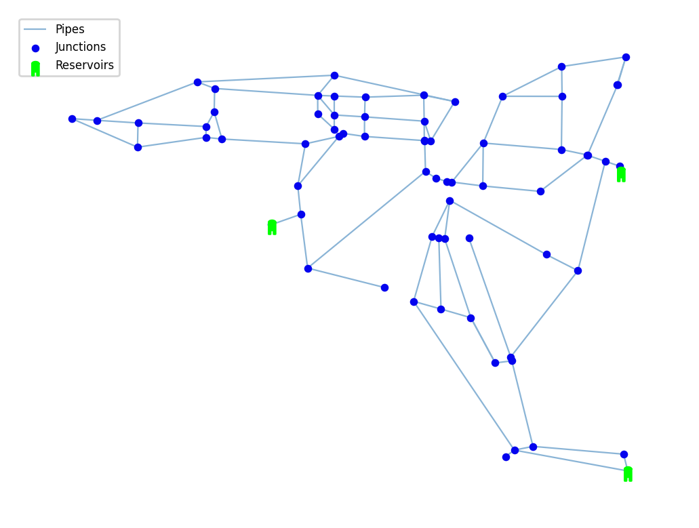

## Description

The `Pescara Network` is a reduced hydraulic model derived from the water distribution system of a medium-sized Italian city. 
The EPANET file represents a small network with 89 junctions, 99 pipes, and 3 reservoirs, capturing the essential hydraulic structure while simplifying the full real system.

## How to Use

The Pescara Network is provided as an .inp file and can be loaded into EPANET or any other software package supporting .inp files.

## Reference

Bragalli, Cristiana, et al. "Water network design by MINLP." _Rep. No. RC24495_ (2008). 
