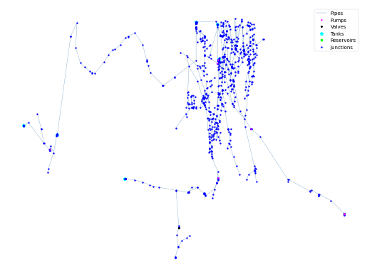

## Description

The file Richmond_standard  is an input file for the Epanet hydraulic network analysis software (1). It contains a general, though not updated, description of the Richmond water distribution system, owned by Yorkshire Water in the UK. It was used in a PhD research project on operational optimization of water distribution systems by Kobus van Zyl (2,3) at the University of Exeter in 2001.

Yorkshire Water gave permission for the Richmond model to be used in academic studies, but in return would like to be kept informed about how it's being used and to see any outputs/papers. Researchers may contact Yorkshire Water through Mark Randall-Smith ( mark.randall-smith@ewan.co.uk). Kobus van Zyl can be contacted at ( jevz@ing.rau.ac.za orkobusvanzyl@mail.com).

The network consists of 872 nodes, 928 pipes, 7 pumps, 6 tanks, 1 reservoir and 1 valve. It contains a demand pattern for 1 day.




## How to Use

The RCH network is provided as an .inp file and can be loaded into EPANET or any other software package
supporting .inp files.

### Usage in Python

The RCH network is also available in Python through the key "*Network-RCH*":
```python
network = load("Network-RCH")
rch_inp = network.load()
```

Detailed information about the provided functionality can be found in the documentation of
[`load()`](https://waterbenchmarkhub.readthedocs.io/en/latest/water_benchmark_hub.networks.html#water_benchmark_hub.networks.networks.RCH.load).


## Reference
Van Zyl, Jakobus Ernst. A methodology for improved operational optimization of water distribution systems. 2001. Doktorarbeit. University of Exeter.
