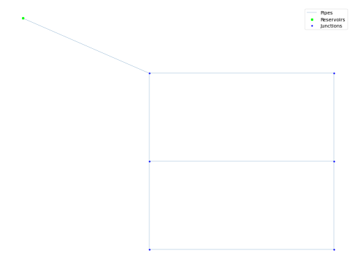

## Description

The synthetic Two Loop Network was created in order to test the optimization of the network design for different flow rates via the linear programing gradient method.

The network consists of 6 nodes, 8 pipes and 1 reservoir.



## How to Use

The TLN network is provided as an .inp file and can be loaded into EPANET or any other software package
supporting .inp files.

### Usage in Python

The TLN network is also available in Python through the key "*Network-TLN*":
```python
network = load("Network-TLN")
tln_inp = network.load()
```

Detailed information about the provided functionality can be found in the documentation of
[`load()`](https://waterbenchmarkhub.readthedocs.io/en/latest/water_benchmark_hub.networks.html#water_benchmark_hub.networks.networks.TLN.load).


## Reference

Alperovits, E., & Shamir, U. (1977). *Design of optimal water distribution systems*. Water resources research, 13(6), 885-900.
[<i class="bi bi-link"></i>](https://doi.org/10.1029/WR013i006p00885)
