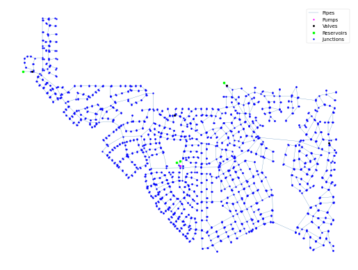

## Description

A model created to optimize water system design.

The network consists of 1786 nodes, 1984 pipes, 6 pumps, 4 reservoirs and 4 valves.



## How to Use

The WCR network is provided as an .inp file and can be loaded into EPANET or any other software package
supporting .inp files.

### Usage in Python

The WCR network is also available in Python through the key "*Network-WCR*":
```python
network = load("Network-WCR")
wcr_inp = network.load()
```

Detailed information about the provided functionality can be found in the documentation of
[`load()`](https://waterbenchmarkhub.readthedocs.io/en/latest/water_benchmark_hub.networks.html#water_benchmark_hub.networks.networks.WCR.load).


## Reference

Lippai, Istvan. Colorado Springs utilities case study: Water system calibration/optimization. In: Pipelines 2005: Optimizing Pipeline Design, Operations, and Maintenance in Today's Economy. 2005. S. 1047-1057.
[<i class="bi bi-link"></i>](https://doi.org/10.1061/40800(180)84)

Lippai, Istvan; Wright, Len. Criticality analysis case study: Zone 7 water distribution system. In: Pipelines 2005: Optimizing Pipeline Design, Operations, and Maintenance in Today's Economy. 2005. S. 662-673.
[<i class="bi bi-link"></i>](https://doi.org/10.1061/40800(180)53)

Lippai, Istvan. Water system design by optimization: Colorado Springs utilities case studies. In: Pipelines 2005: Optimizing Pipeline Design, Operations, and Maintenance in Today's Economy. 2005. S. 1058-1070.
[<i class="bi bi-link"></i>](https://doi.org/10.1061/40800(180)85)
