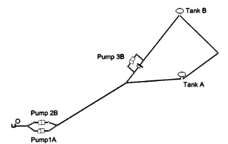

## Description

The file van_zyl_2004  is an input file for the Epanet hydraulic network analysis software. It contains a general, though not updated, description of a small network used for pump scheduling studies.

It was used in a PhD research project on operational optimization of water distribution systems by Kobus van Zyl (1) at the University of Exeter in 2001.

Researchers may contact Kobus van Zyl can be contacted at ( jevz@ing.rau.ac.za orkobusvanzyl@mail.com).

## How to Use

The Van Zyl 2004 network is provided as an .inp file and can be loaded into EPANET or any other software package
supporting .inp files.

## Reference
(1) Van Zyl, J.E. (2001). A methodology for improved operational optimization of water distribution systems, Ph.D. thesis, University of Exeter, UK

(2) Van Zyl, J.E., Savic, D.A., Walters, G.A. (2004). Operational Optimization of Water Distribution Systems Using a Hybrid Genetic Algorithm, Journal of Water Resources Planning and Management, ASCE, 130 (3), 160-170.