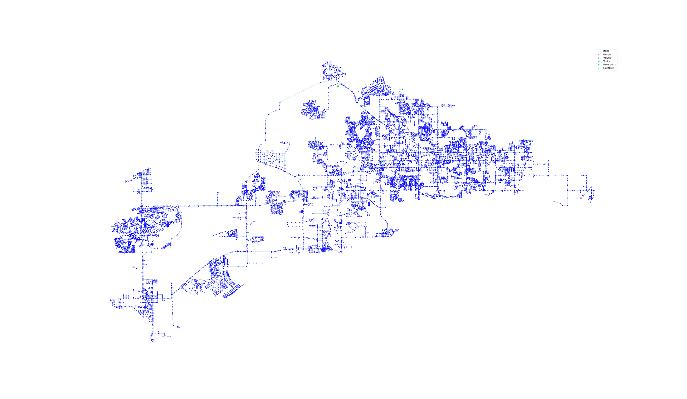

## Description

The BWSN-2 network is an artifical network that was first
introduced in the [BWSN competition](BWSN.html) in 2006 together with the
much smaller [BWSN-1 network](network-BWSN-1.html).

The network is quite large and consists of 12523 junctions, 14314 pipes, 2 reservoir, 2 tanks,
4 pumps, and 5 valves.
Furthermore, it also contains a simple demand pattern for two days.




## How to Use

BWSN-2 is provided as an .inp file and can be loaded into EPANET or any other software package
supporting .inp files.

### Usage in Python

BWSN-2 is also available in Python through the key "*Network-BWSN-2*":
```python
network = load("Network-BWSN-2")
bwsn2_inp = network.load()
```

Detailed information about the provided functionality can be found in the documentation of
[`load()`](https://water-benchmark-hub.readthedocs.io/en/stable/water_benchmark_hub.networks.html#water_benchmark_hub.networks.networks.BWSN2.load).


## Reference

Avi Ostfeld, James G. Uber, Elad Salomons, Jonathan W. Berry, William E. Hart, Cindy A. Phillips,
Jean-Paul Watson, Gianluca Dorini, Philip Jonkergouw, Zoran Kapelan, Francesco di Pierro,
Soon-Thiam Khu, Dragan Savic, Demetrios Eliades, Marios Polycarpou, Santosh R. Ghimire,
Brian D. Barkdoll, Roberto Gueli, Jinhui J. Huang, Edward A. McBean, William James, Andreas Krause,
Jure Leskovec, Shannon Isovitsch, Jianhua Xu, Carlos Guestrin, Jeanne VanBriesen, Mitchell Small,
Paul Fischbeck, Ami Preis, Marco Propato, Olivier Piller, Gary B. Trachtman, Zheng Yi Wu,
and Tom Walski. (2008).
*The battle of the water sensor networks (BWSN): A design challenge for engineers and algorithms.*
Journal of water resources planning and management, 134(6).