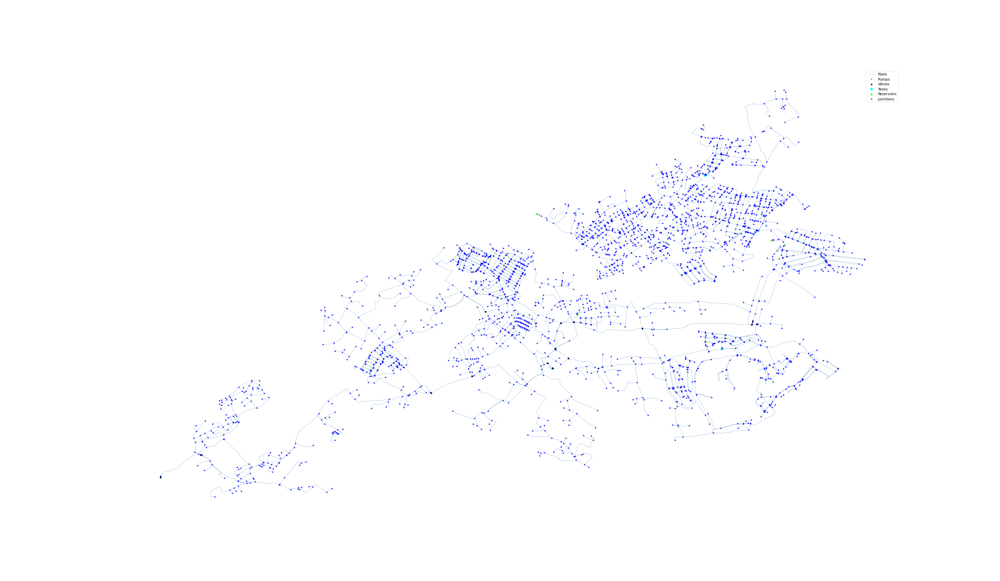

## Description

The E-Town network (also refered to as the BIWS network) is an artifical network that was first
introduced in the [BIWS competition](BIWS.html) in 2022.

The network is quite large and consists of 2859 junctions, 3198 pipes, 6 reservoir, 4 tanks,
7 pumps, and 15 valves.
Furthermore, the network also contains a simple demand pattern for one week.



## How to Use

E-Town is provided as an .inp file and can be loaded into EPANET or any other software package
supporting .inp files.

### Usage in Python

E-Town is also available in Python through the key "*Network-ETown*":
```python
network = load("Network-ETown")
etown_inp = network.load()
```

Detailed information about the provided functionality can be found in the documentation of
[`load()`](https://water-benchmark-hub.readthedocs.io/en/stable/water_benchmark_hub.networks.html#water_benchmark_hub.networks.networks.ETown.load).


## Reference

Pedro L. Iglesias-Rey, Fernando Martínez-Alzamora, F. Javier Martínez Solano, Avi Ostfeld, (2022).
*Battle of Intermittent Water Supply (BIWS).*
2nd International Joint Conference on Water Distribution System Analysis (WDSA) and Computing and
Control in the Water Industry (CCWI)
[<i class="bi bi-link"></i>](https://ascelibrary.org/jwrmd5/battle-intermittent-biws)
