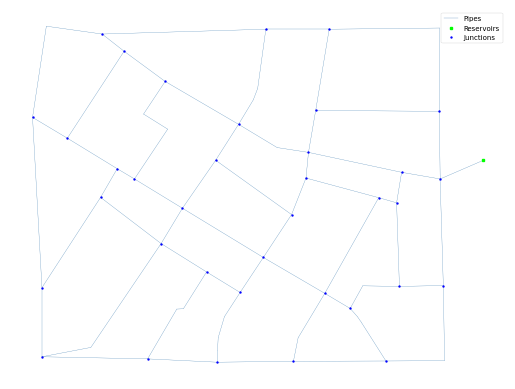

## Description

The Fossolo system is based on the Fossolo neighborhood distribution system in Bologna, Italy and was originally
developed by Bragalli et al. in 2008 as part of a design optimization study. The system has a total demand of 3,000 CMD,
one reservoir, and 8.4 km of pipe. It is classified as transmission dense-loop by Hwang & Lansey (2017) and looped by
Hoagland et al. (2015).

It was published 2016 by University of Kentucky Libraries.

The network consists of 36 nodes (junctions), 58 pipes and 1 reservoir.



## How to Use

The Fossolo network is provided as an .inp file and can be loaded into EPANET or any other software package
supporting .inp files.

### Usage in Python

The Fossolo network is also available in Python through the key "*Network-Fossolo*":
```python
network = load("Network-Fossolo")
fossolo_inp = network.load()
```

Detailed information about the provided functionality can be found in the documentation of
[`load()`](https://water-benchmark-hub.readthedocs.io/en/stable/water_benchmark_hub.networks.html#water_benchmark_hub.networks.networks.Fossolo.load).


## Reference

Dandy, Graeme, "03 Fossolo" (2016). International Systems. 3.
https://uknowledge.uky.edu/wdst_international/3

Bragalli, C. Ambrosio, D., Lee, J., Lodi, A., Toth, P. 2008. IBM Research Report: Water Network Design by MINLP. RC24495
(W0802-056) https://dominoweb.draco.res.ibm.com/ef1b90113cc7b03a852573fc00529261.html

Creaco, E. and Franchini, M. (2014) Low level hybrid procedure for the multi-objective design of water distribution
networks, Procedia Engineering 70, 369 – 378

Bi, W., Dandy, G. C. and Maier, H. R. (2015) Improved genetic algorithm optimization of water distribution system design
by incorporating domain knowledge, Environmental Modelling & Software, Vol. 69, 370-381.
