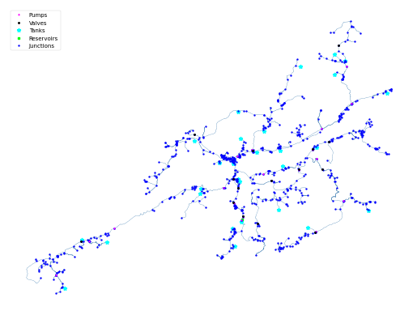

## Description

The KY 11 system is based on a real-world system in KY and was originally used by Jolly et al. in 2014 as part of a
classification study. The system has a total demand of 1.93 MGD, one reservoir, 28 tanks, 21 pumps, and 278 miles of
pipe. It is classified as distribution branch by Hwang & Lansey (2017) and branched by Hoagland et al. (2015).

It was published 2016 by University of Kentucky Libraries.

The network consists of 730 nodes (junctions), 846 pipes, 28 tanks, 21 pumps and 1 reservoir.



## How to Use

The KY11 network is provided as an .inp file and can be loaded into EPANET or any other software package
supporting .inp files.

### Usage in Python

The KY11 network is also available in Python through the key "*Network-KY11*":
```python
network = load("Network-KY11")
ky11_inp = network.load()
```

Detailed information about the provided functionality can be found in the documentation of
[`load()`](https://water-benchmark-hub.readthedocs.io/en/stable/water_benchmark_hub.networks.html#water_benchmark_hub.networks.networks.KY11.load).


## Reference

Hoagland, Steven, "11 KY 11" (2016). Kentucky Dataset. 13.
[<i class="bi bi-link"></i>](https://uknowledge.uky.edu/wdst/13)

Jolly, M. D., Lothes, A. D., Bryson, L. S., & Ormsbee, L. (2014). *Research Database of Water Distribution System Models.*
Journal of Water Resources Planning and Management, 410-416. 10.1061/(ASCE)WR.1943-5452.0000352
[<i class="bi bi-link"></i>](https://doi.org/10.1061/(ASCE)WR.1943-5452.0000352)
