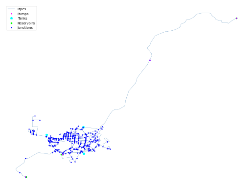

## Description

The KY 14 system is based on a real-world system in KY and was originally used by Jolly et al. in 2014 as part of a
classification study. The system has a total demand of 2.12 MGD, four reservoirs, three tanks, six pumps, and 64.5 miles
of pipe. It is classified as distribution dense-grid by Hwang & Lansey (2017) and gridded by Hoagland et al. (2015).

It was published 2016 by University of Kentucky Libraries.

The network consists of 366 nodes (junctions), 548 pipes, 3 tanks, 6 pumps and 4 reservoirs.



## How to Use

The KY14 network is provided as an .inp file and can be loaded into EPANET or any other software package
supporting .inp files.

### Usage in Python

The KY14 network is also available in Python through the key "*Network-KY14*":
```python
network = load("Network-KY14")
ky14_inp = network.load()
```

Detailed information about the provided functionality can be found in the documentation of
[`load()`](https://water-benchmark-hub.readthedocs.io/en/stable/water_benchmark_hub.networks.html#water_benchmark_hub.networks.networks.KY14.load).


## Reference

Hoagland, Steven, "14 KY 14" (2016). Kentucky Dataset. 16.
[<i class="bi bi-link"></i>](https://uknowledge.uky.edu/wdst/16)

Schal, S., Bryson, L.S. and Ormsbee, L., 2014. A graphical procedure for sensor-placement guidance for small utilities.
Journal-American Water Works Association, 106(10), pp.E459-E469.
[<i class="bi bi-link"></i>](https://doi.org/10.5942/JAWWA.2014.106.0093)
