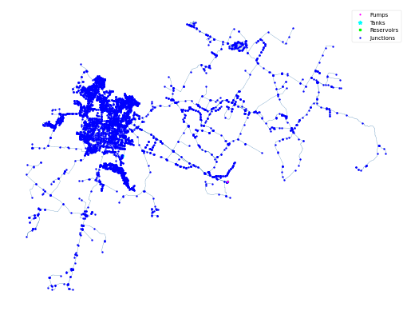

## Description

The KY 17 system is based on a real-world system in KY and was originally used by Hoagland in 2015 as part of a
classification study. The system has a total demand of 9.0 MGD, one reservoir, three tanks, five pumps, and 282 miles of
pipe. It is classified as distribution hybrid by Hwang & Lansey (2017) and gridded by Hoagland et al. (2015).

It was published 2021 by University of Kentucky Libraries.

The network consists of 6242 nodes (junctions), 6567 pipes, 3 tanks, 5 pumps and 1 reservoir.



## How to Use

The KY17 network is provided as an .inp file and can be loaded into EPANET or any other software package
supporting .inp files.

### Usage in Python

The KY17 network is also available in Python through the key "*Network-KY17*":
```python
network = load("Network-KY17")
ky17_inp = network.load()
```

Detailed information about the provided functionality can be found in the documentation of
[`load()`](https://water-benchmark-hub.readthedocs.io/en/stable/water_benchmark_hub.networks.html#water_benchmark_hub.networks.networks.KY17.load).


## Reference

Hoagland, Steven, "17 KY 17" (2021). Kentucky Dataset. 37.
https://uknowledge.uky.edu/wdst/37

Hoagland, Steven & Schal, Stacey & Ormsbee, Lindell & Bryson, Lindsey. (2015). Classification of Water Distribution
Systems for Research Applications. 696-702. 10.1061/9780784479162.064.
