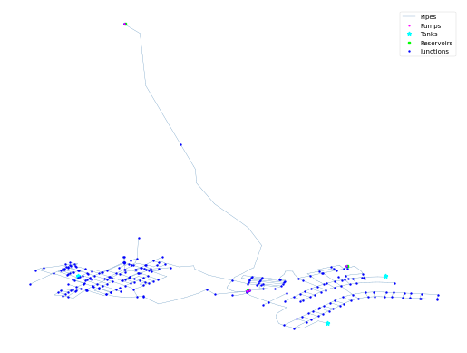

## Description

The KY 3 system is based on a real-world system in KY and was originally used by Jolly et al. in 2014 as part of a
classification study. The system has a total demand of 2.02 MGD, three reservoirs, three tanks, five pump, and 52.5
miles of pipe. It is classified as distribution dense-grid by Hwnag & Lansey (2017) and gridded by Hoagland et al.
(2015).

It was published 2016 by University of Kentucky Libraries.

The network consists of 270 nodes (junctions), 366 pipes, 3 tanks, 5 pumps and 3 reservoirs.



## How to Use

The KY3 network is provided as an .inp file and can be loaded into EPANET or any other software package
supporting .inp files.

### Usage in Python

The KY3 network is also available in Python through the key "*Network-KY3*":
```python
network = load("Network-KY3")
ky3_inp = network.load()
```

Detailed information about the provided functionality can be found in the documentation of
[`load()`](https://water-benchmark-hub.readthedocs.io/en/stable/water_benchmark_hub.networks.html#water_benchmark_hub.networks.networks.KY3.load).


## Reference

Hoagland, Steven, "03 KY 3" (2016). Kentucky Dataset. 5.
https://uknowledge.uky.edu/wdst/5

Jolly, M. D., Lothes, A. D., Bryson, L. S., & Ormsbee, L. (2014). Research Database of Water Distribution System Models.
Journal of Water Resources Planning and Management, 410-416. 10.1061/(ASCE)WR.1943-5452.0000352
