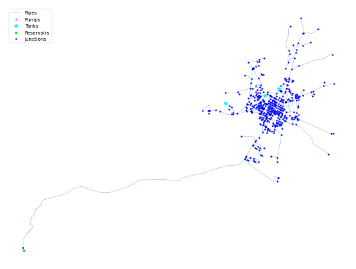

## Description

The KY 7 system is based on a real-world system in KY and was originally used by Jolly et al. in 2014 as part of a
classification study. The system has a total demand of 1.53 MGD, one reservoir, three tanks, one pump, and 79.3 miles of
pipe. It is classified as distribution dense-grid by Hwang & Lansey (2017) and gridded by Hoagland et al. (2015).

It was published 2016 by University of Kentucky Libraries.

The network consists of 479 nodes (junctions), 603 pipes, 3 tanks, 1 pump and 1 reservoir.



## How to Use

The KY7 network is provided as an .inp file and can be loaded into EPANET or any other software package
supporting .inp files.

### Usage in Python

The KY7 network is also available in Python through the key "*Network-KY7*":
```python
network = load("Network-KY7")
ky7_inp = network.load()
```

Detailed information about the provided functionality can be found in the documentation of
[`load()`](https://water-benchmark-hub.readthedocs.io/en/stable/water_benchmark_hub.networks.html#water_benchmark_hub.networks.networks.KY7.load).


## Reference

Hoagland, Steven, "07 KY 7" (2016). Kentucky Dataset. 9.
[<i class="bi bi-link"></i>](https://uknowledge.uky.edu/wdst/9)

Jolly, M. D., Lothes, A. D., Bryson, L. S., & Ormsbee, L. (2014). Research Database of Water Distribution System Models.
Journal of Water Resources Planning and Management, 410-416. 10.1061/(ASCE)WR.1943-5452.0000352
[<i class="bi bi-link"></i>](https://doi.org/10.1061/(ASCE)WR.1943-5452.0000352)
