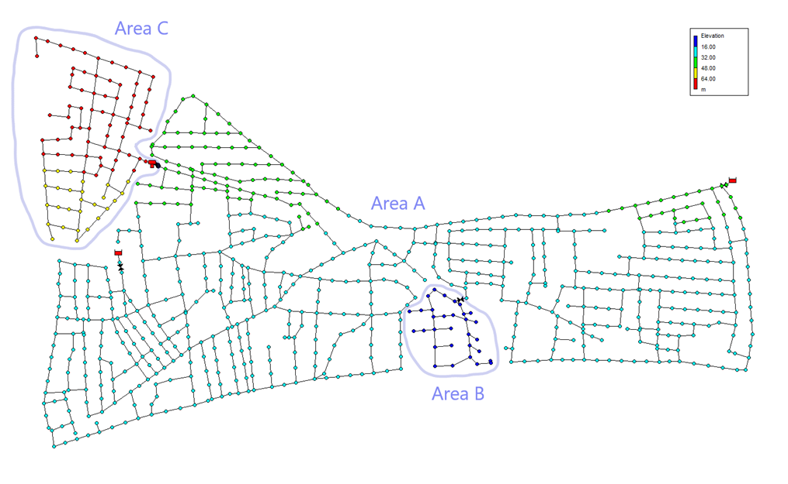

## Description

L-Town is a small hypothetical town with a population of around 10,000 people.
The water utility of L-Town is responsible for delivering drinking water to consumers through
a network of pipes with a total length of 42.6km.
The water distribution network of L-Town is receiving water from two (2) reservoirs,
and the water utility aims at providing water with a pressure head of at least 20m to all
of its consumers. A Pressure Reduction Valve (PRV) is installed in the lower part of the town
("Area B"), to help reducing background leakages. PRVs are also installed downstream of the
two main reservoirs, to help regulating the pressure. A pump and a water tank have been installed
in the higher part of the town ("Area C"), to provide sufficient pressure to the consumers
of that area. The tank has a diameter of 16 meters with a cylindrical shape. The pump has been
programmed so that the tank should be refilling during the night and emptying to
"Area C" during the day.
There are three consumer types in L-Town: residential, commercial and industrial.
During workdays (Monday to Friday), water consumption follows a similar pattern,
whereas during the weekend (Saturday and Sunday), there is higher consumption during late hours as
the result of night life. Areas with industrial users do not follow the same pattern of consumption.
L-Town is located in the Northern hemisphere, thus higher water usage is expected around
July/August, and lower in December/January.
There are no significant variations of water consumption during holidays or other special days.

The network consists of 782 nodes (junctions), 923 pipes, 2 reservoirs, 1 tank, 1 pump,
and 3 valves.



## How to Use

The L-Town network is provided as two different versions, which can be loaded into EPANET
or any other software package
supporting .inp files:
- `L-TOWN.inp`: L-Town network without any demand patters.
- `L-TOWN_Real.inp`: L-Town network with realistic demand patterns as used in the
[BattLeDIM](KIOS-BattLeDIM.html) benchmark.

### Usage in Python

L-Town is also available in Python through the key "*Network-LTown*":
```python
network = load("Network-LTown")
ltown_inp = network.load()
```

Detailed information about the provided functionality can be found in the documentation of
[`load()`](https://water-benchmark-hub.readthedocs.io/en/stable/water_benchmark_hub.networks.html#water_benchmark_hub.networks.networks.LTown.load).


## Reference

S. G. Vrachimis, D. G. Eliades, R. Taormina, Z. Kapelan, A. Ostfeld, S. Liu, M. Kyriakou, P. Pavlou,
M. Qiu, and M. M. Polycarpou. Forthcoming. *Battle of the Leakage Detection and Isolation Methods*,
Journal of Water Resources Planning and Management, 10.1061/(ASCE)WR.1943-5452.0001601