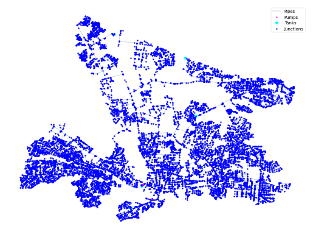

## Description

The NJ 1 system is based on the Dover Township, NJ Distribution system and was originally used by Maslia et al. in 2000
as part of an epidemiological study. The system has a total demand of 7.7 MGD, eight tanks, 12 pumps, and 483 miles of
pipe. It is classified as distribution sparse-grid by Hwang & Lansey (2017) and looped by Hoagland et al. (2015).

It was published 2021 by University of Kentucky Libraries.

The network consists of 14991 nodes (junctions), 16090 pipes and 8 tanks and 12 pumps.



## How to Use

The NJ1 network is provided as an .inp file and can be loaded into EPANET or any other software package
supporting .inp files.

### Usage in Python

The NJ1 network is also available in Python through the key "*Network-NJ1*":
```python
network = load("Network-NJ1")
nj1_inp = network.load()
```

Detailed information about the provided functionality can be found in the documentation of
[`load()`](https://water-benchmark-hub.readthedocs.io/en/stable/water_benchmark_hub.networks.html#water_benchmark_hub.networks.networks.NJ1.load).


## Reference

Maslia, Morris, "05 NJ 1" (2021). US Systems. 5.
[<i class="bi bi-link"></i>](https://uknowledge.uky.edu/wdst_us/5)

Maslia, M.L., Sautner, J.B., Aral, M.M., Reyes, J.J., Abraham, J.E. and Williams, R.C., 2000. Using water-distribution
system modeling to assist epidemiologic investigations. Journal of Water Resources Planning and Management, 126(4),
pp.180-198.
[<i class="bi bi-link"></i>](https://doi.org/10.1061/(ASCE)0733-9496(2000)126:4(180))
