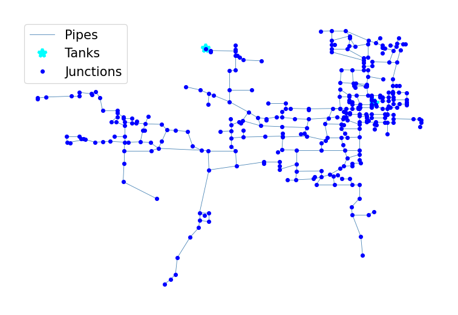

## Description

The PA 1 system is based on the North Penn Water Authority Distribution system in Pennsylvania and was originally used
by Clark in 1994 as part of a water quality modelling study. The system has a total demand of 2.7 MGD, two tanks and 99
miles of pipe. It is classified as distribution dense-grid by Hwang & Lansey (2017) and gridded by Hoagland et al.
(2015).

It was published 2016 by University of Kentucky Libraries.

The network consists of 337 nodes (junctions), 399 pipes, and 2 tanks. It contains a demand pattern for one and a half
days.



## How to Use

The PA1 network is provided as an .inp file and can be loaded into EPANET or any other software package
supporting .inp files.

### Usage in Python

The PA1 network is also available in Python through the key "*Network-PA1*":
```python
network = load("Network-PA1")
pa1_inp = network.load()
```

Detailed information about the provided functionality can be found in the documentation of
[`load()`](https://water-benchmark-hub.readthedocs.io/en/stable/water_benchmark_hub.networks.html#water_benchmark_hub.networks.networks.PA1.load).


## Reference

Boccelli, Dominic L., "02 PA 1" (2016). US Systems. 2.
[<i class="bi bi-link"></i>](https://uknowledge.uky.edu/wdst_us/2)

Clark, R.M., 1994. *Applying water quality models.* In Computer Modeling of Free-Surface and Pressurized Flows
(pp. 581-612). Springer, Dordrecht.
[<i class="bi bi-link"></i>](https://link.springer.com/chapter/10.1007/978-94-011-0964-2_20)

Vasconcelos, J.J., Rossman, L.A., Grayman, W.M., Boulos, P.F. and Clark, R.M., 1997. *Kinetics of chlorine decay.*
Journal-American Water Works Association, 89(7), pp.54-65.
[<i class="bi bi-link"></i>](https://doi.org/10.1002/j.1551-8833.1997.tb08259.x)
