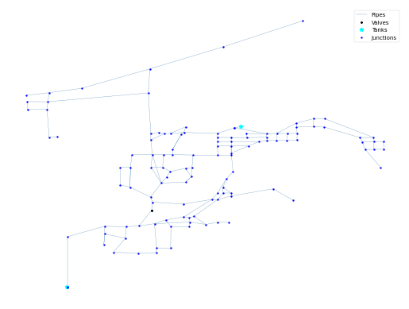

## Description

The WA 1 system is based on the Bellingham, WA distribution system and was originally developed by Vasconcelos et al.
in 1997 as part of a water quality modelling study. The system has a total demand of 5.9 MGD, two tanks, and 30.5 miles
of pipe. It is classified as distribution dense-grid by Hwang & Lansey (2017) and looped by Hoagland et al. (2015).

It was published 2016 by University of Kentucky Libraries.

The network consists of 121 nodes (junctions), 170 pipes and 2 tanks.



## How to Use

The WA1 network is provided as an .inp file and can be loaded into EPANET or any other software package
supporting .inp files.

### Usage in Python

The WA1 network is also available in Python through the key "*Network-WA1*":
```python
network = load("Network-WA1")
wa1_inp = network.load()
```

Detailed information about the provided functionality can be found in the documentation of
[`load()`](https://water-benchmark-hub.readthedocs.io/en/stable/water_benchmark_hub.networks.html#water_benchmark_hub.networks.networks.WA1.load).


## Reference

Boccelli, Dominic L., "04 WA 1" (2016). US Systems. 4.
[<i class="bi bi-link"></i>](https://uknowledge.uky.edu/wdst_us/4)

Vasconcelos, J.J., Rossman, L.A., Grayman, W.M., Boulos, P.F. and Clark, R.M., 1997. Kinetics of chlorine decay.
Journal-American Water Works Association, 89(7), pp.54-65.
[<i class="bi bi-link"></i>](https://doi.org/10.1002/j.1551-8833.1997.tb08259.x)
