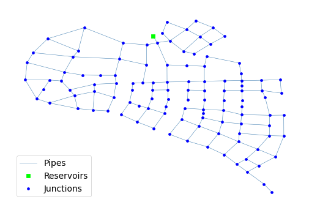

## Description

The Zhi Jiang system is based on the Zhi Jiang water distribution system in the eastern province of China and was
originally developed by Zheng et al. in 2011 as part of a design optimization study. The system has a total demand of
484,000 CMD, one reservoir, and 126 km of pipe. It is classified as transmission dense-loop by Hwang & Lansey (2017) and
gridded by Hoagland et al (2015).

It was published 2016 by University of Kentucky Libraries.

The network consists of 113 nodes (junctions), 164 pipes and 1 reservoir.



## How to Use

The Zhi Jiang network is provided as an .inp file and can be loaded into EPANET or any other software package
supporting .inp files.

### Usage in Python

The Zhi Jiang network is also available in Python through the key "*Network-Zhi-Jiang*":
```python
network = load("Network-Zhi-Jiang")
zhi_jiang_inp = network.load()
```

Detailed information about the provided functionality can be found in the documentation of
[`load()`](https://water-benchmark-hub.readthedocs.io/en/stable/water_benchmark_hub.networks.html#water_benchmark_hub.networks.networks.ZhiJiang.load).


## Reference

Dandy, Graeme, "06 Zhi Jiang" (2016). International Systems. 6.
[<i class="bi bi-link"></i>](https://uknowledge.uky.edu/wdst_international/6)

Zheng, Feifei, Simpson, Angus R & Zecchin, Aaron C, 2011. *A combined NLP-differential evolution algorithm approach for
the optimization of looped water distribution systems.* Water resources research, 47(8)
[<i class="bi bi-link"></i>](https://doi.org/10.1029/2011WR010394)

Bi, W., Dandy, G. C. and Maier, H. R. (2015) *Improved genetic algorithm optimization of water distribution system design
by incorporating domain knowledge*, Environmental Modelling & Software, Vol. 69, 370-381.
[<i class="bi bi-link"></i>](https://doi.org/10.1016/j.envsoft.2014.09.010)
